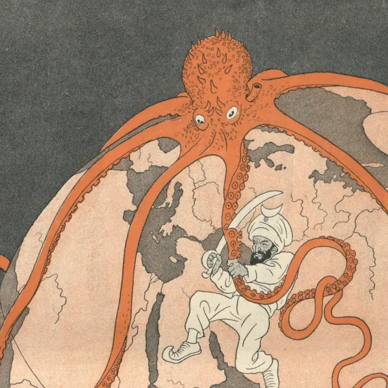
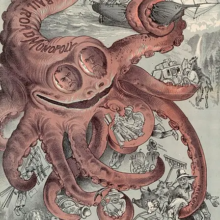
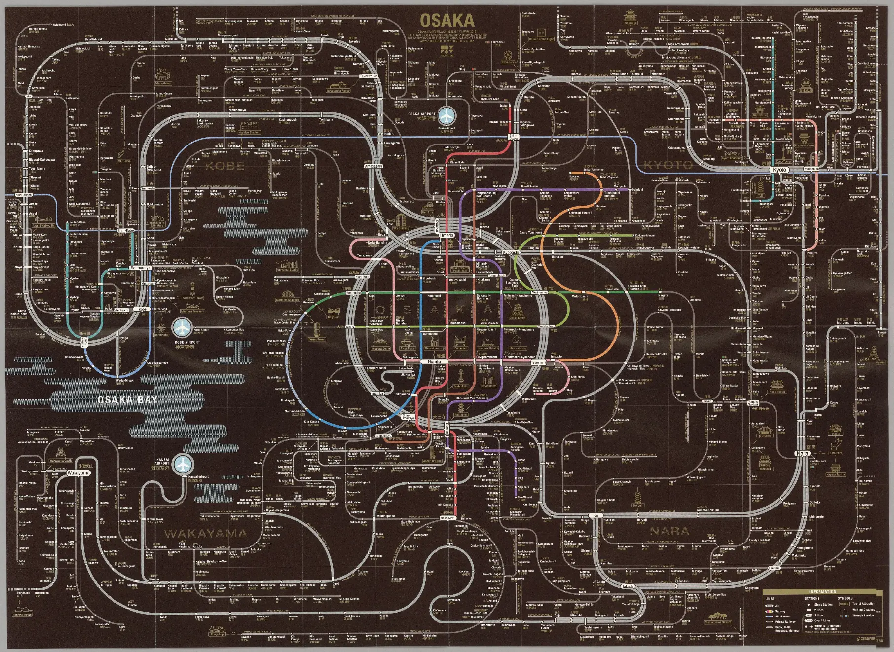
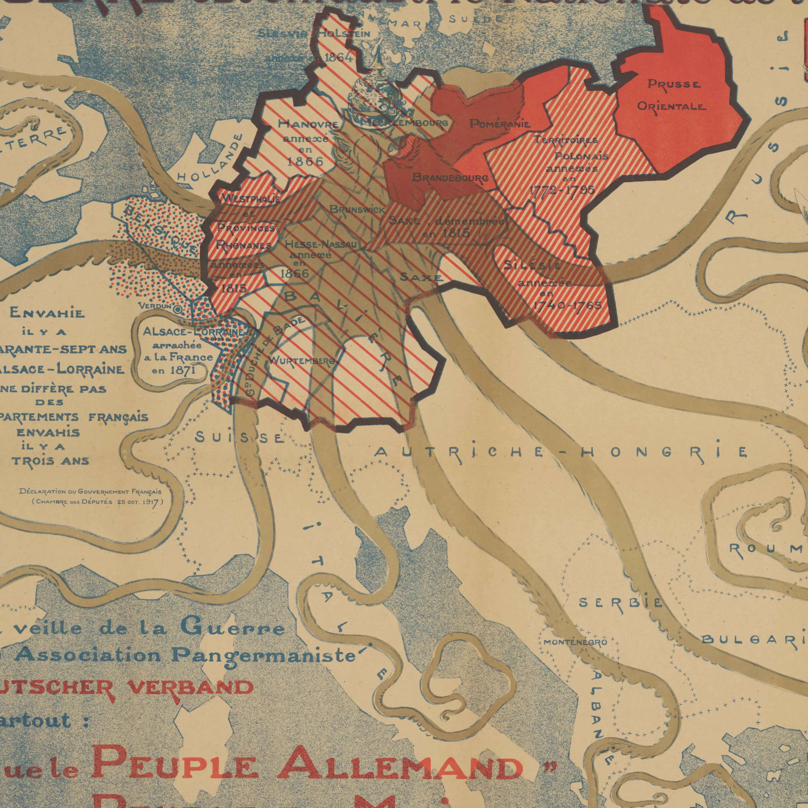

<section
  class="hero min-h-150"
  style="background-image: url(/assets/img/war.webp);"
>
  

  

    

      <h1 class="mb-5 text-5xl font-playfair font-bold text-neutral-content">Octopus Map in a Nutshell</h1>
      

        The most famous octopus map is Serio-Comic War Map by F.W. Rose. Personifying the European countries with vivid details.
      

      

        <button class="btn btn-secondary text-neutral-content btn-wide text-xl py-5">Read More</button>
      

    

  

</section>

<section class="grid sm:grid-cols-2 md:grid-cols-3 lg:grid-cols-4 gap-4 p-5">
  <article class="card bg-base-100 shadow-sm">
    <figure>
      
    </figure>
    

      <h2 class="card-title">A Humorous Diplomatic Move</h2>
      
1877

      

        <button class="btn btn-secondary text-neutral-content">Read More</button>
      

    

  </article>
  <article class="card bg-base-100 shadow-sm">
    <figure>
      
    </figure>
    

      <h2 class="card-title">Card Title</h2>
      
A card component has a figure, a body part, and inside body there are title and actions parts

      

        <button class="btn btn-secondary text-neutral-content">Read More</button>
      

    

  </article>
  <article class="card bg-base-100 shadow-sm">
    <figure>
      
    </figure>
    

      <h2 class="card-title">Card Title</h2>
      
A card component has a figure, a body part, and inside body there are title and actions parts

      

        <button class="btn btn-secondary text-neutral-content">Read More</button>
      

    

  </article>
  <article class="card bg-base-100 shadow-sm">
    <figure>
      
    </figure>
    

      <h2 class="card-title">Card Title</h2>
      
A card component has a figure, a body part, and inside body there are title and actions parts

      

        <button class="btn btn-secondary text-neutral-content">Read More</button>
      

    

  </article>

</section>